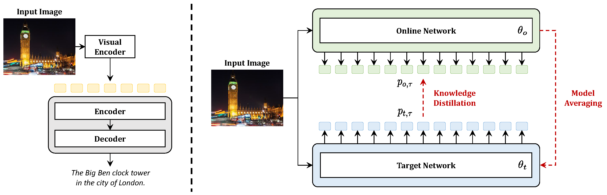
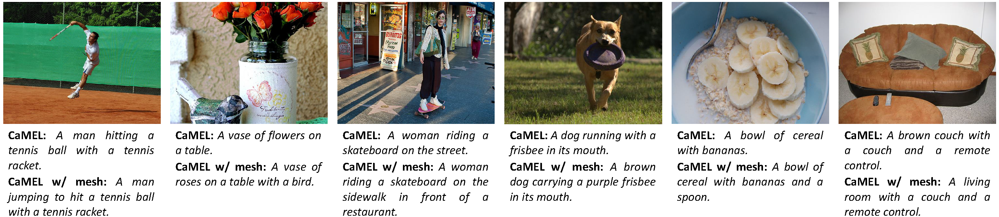

# CaMEL: Mean Teacher Learning for Image Captioning
This repository contains the reference code for the paper _[CaMEL: Mean Teacher Learning for Image Captioning](https://arxiv.org/pdf/2202.10492.pdf)_.

Please cite with the following BibTeX:
```
@inproceedings{barraco2022camel,
  title={{CaMEL: Mean Teacher Learning for Image Captioning}},
  author={Barraco, Manuele and Stefanini, Matteo and Cornia, Marcella and Cascianelli, Silvia and Baraldi, Lorenzo and Cucchiara, Rita},
  booktitle={International Conference on Pattern Recognition},
  year={2022}
}
```

<p align="center">

</p>

## Environment setup
Clone the repository and create the `camel_release` conda environment using the `environment.yml` file:
```
conda env create -f environment.yml
conda activate camel_release
```

Note: Python 3.8 is required to run our code. 

<p align="center">

</p>

## Data preparation
To run the code, annotations and images for the COCO dataset are needed.
Please download the zip files containing the images ([train2014.zip](http://images.cocodataset.org/zips/train2014.zip), [val2014.zip](http://images.cocodataset.org/zips/val2014.zip)), and the annotations ([annotations.zip](https://drive.google.com/file/d/1i8mqKFKhqvBr8kEp3DbIh9-9UNAfKGmE/view?usp=sharing)) and extract them. 
These paths will be set as arguments later.

## Evaluation
To reproduce the results reported in our paper, download the pretrained model file [camel_mesh.pth](https://aimagelab.ing.unimore.it/go/camel_mesh.pth) or [camel_nomesh.pth](https://aimagelab.ing.unimore.it/go/camel_nomesh.pth) and place it anywhere. Its path will be set as argument later.

Run `python evaluation.py` using the following arguments:

| Argument | Possible values |
|------|------|
| `--batch_size` | Batch size (default: `25`) |
| `--workers` | Number of workers (default: `0`) |
| `--resume_last` | If used, the training will be resumed from the last checkpoint |
| `--resume_best` | If used, the training will be resumed from the best checkpoint |
| `--annotation_folder` | Path to folder with COCO annotations (required) |
| `--image_folder` | Path to folder with COCO images (required) |
| `--saved_model_path` | Path to model weights file (required) |
| `--clip_variant` | CLIP variant to be used as image encoder (default: `RN50x16`) |
| `--network` | Network to be used in the evaluation, `online` or `target` (default: `target`) |
| `--disable_mesh` | If used, the model does not employ the mesh connectivity |
| `--N_dec` | Number of decoder layers (default: `3`) |
| `--N_enc` | Number of encoder layers (default: `3`) |
| `--d_model` | Dimensionality of the model (default: `512`) |
| `--d_ff` | Dimensionality of Feed-Forward layers (default: `2048`) |
| `--m` | Number of memory vectors (default: `40`) |
| `--head` | Number of heads (default: `8`) |

For example, to evaluate our model, use
```
python evaluate.py --image_folder /path/to/images --annotation_folder /path/to/annotations --saved_model_path /path/to/model_file.pth
```

## Training procedure
Run `python train.py` using the following arguments:

| Argument | Possible values |
|------|------|
| `--exp_name` | Experiment name (default: `camel`) |
| `--batch_size` | Batch size (default: `25`) |
| `--workers` | Number of workers (default: `0`) |
| `--resume_last` | If used, the training will be resumed from the last checkpoint |
| `--resume_best` | If used, the training will be resumed from the best checkpoint |
| `--annotation_folder` | Path to folder with COCO annotations (required) |
| `--image_folder` | Path to folder with COCO images (required) |
| `--clip_variant` | CLIP variant to be used as image encoder (default: `RN50x16`) |
| `--distillation_weight` | Weight for the knowledge distillation loss (default: `0.1` in XE phase, `0.005` in SCST phase) |
| `--ema_weight` | Target decay rate of Mean Teacher paradigm (default: `0.999`) |
| `--phase` | Training phase, `xe` or `scst` (default: `xe`) |
| `--disable_mesh` | If used, the model does not employ the mesh connectivity |
| `--saved_model_file` | If used, path to model weights to be loaded |
| `--N_dec` | Number of decoder layers (default: `3`) |
| `--N_enc` | Number of encoder layers (default: `3`) |
| `--d_model` | Dimensionality of the model (default: `512`) |
| `--d_ff` | Dimensionality of Feed-Forward layers (default: `2048`) |
| `--m` | Number of memory vectors (default: `40`) |
| `--head` | Number of heads (default: `8`) |
| `--warmup` | Warmup value for learning rate scheduling (default: `10000`) |

For example, to train our model with the parameters used in our experiments, use
```
python train.py --image_folder /path/to/images --annotation_folder /path/to/annotations
```

<p align="center">

</p>

